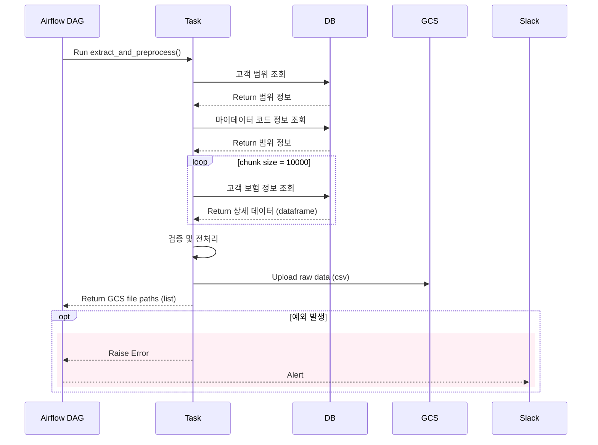
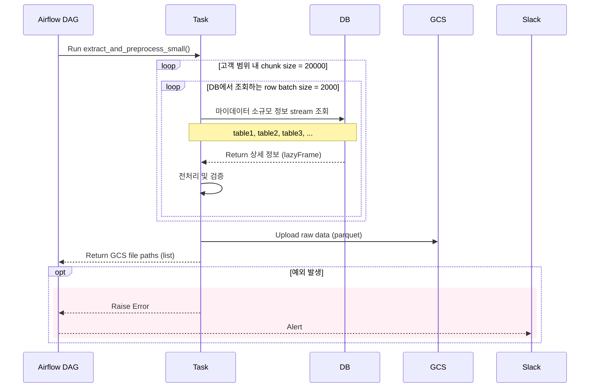
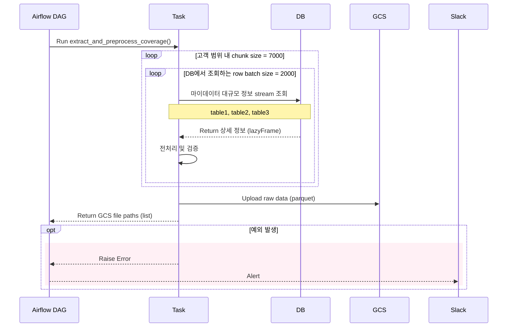

## 문제 상황: 서버가 갑자기 죽었다
Airflow 기반의 데이터 파이프라인을 운영하던 중, 특정 Task가 실행될 때마다 서버가 예고 없이 종료되는 현상이 반복되었다.  
로그에는 단 한 줄의 메시지만 남았다.

```text
Killed (-9)
```

처음에는 단순한 일시적 장애로 여겼지만, 수차례 재실행 후에도 동일 현상이 발생했다.  
서버 로그와 시스템 모니터링 결과를 분석한 끝에, 메모리 초과(OOM, Out of Memory) 로 인한 프로세스 강제 종료임을 확인했다.

요구사항이 변경되어 설계 당시 예상했던 데이터 양보다 수십 배로 증가하며, Airflow worker의 메모리 한계를 초과했다.  
이는 처리 구조 자체가 증가된 데이터 패턴을 감당하지 못한 구조적 문제였다.

---

## 문제 정의: 단순한 ‘용량 초과’가 아니었다

문제의 핵심은 데이터 크기 그 자체가 아니라, 비효율적인 처리 구조와 I/O 병목이었다.  
이를 구체적으로 정리하면 다음과 같다.

### 1️⃣ 모든 데이터를 한 번에 메모리에 적재
- 약 6,000만 건의 데이터를 단일 Task에서 처리함으로써 메모리 부하로 인해 Airflow 서버가 자체적으로 꺼졌다.
- 게다가 MySQL Hook이 `fetchall()` 기반으로 조회한 탓에 전체 데이터를 메모리에 적재하여 GC 불가한 상태였다.
- 대량 데이터 구간(hot spot)에서 OOM이 가속화되었으며, chunk 단위 조회를 하더라도 pandas 내부에서 누적되어 해제되지 않았다.
  - _초기엔 데이터 조회 결과가 적은 경우만 조회할 것으로 판단하고 더 빠른(빠르다고 판단한) fetchall 관련 로직만 사용했었다._

아래는 문제가 되었던 Task의 Sequence Diagram 이다.


### 2️⃣ CSV 기반 I/O 구조와 Pandas의 한계
- CSV는 텍스트 기반 포맷으로, 한 컬럼만 사용하더라도 전체 파일을 디스크에서 모두 읽어야 한다.
  - 즉, row-based I/O 구조 특성상 병렬 읽기와 column-level 접근이 어렵다.
  - 따라서, Task 간 데이터를 GCS로 전달할 때마다 전체를 반복적으로 읽는 구조가 되어 I/O 병목과 CPU 오버헤드가 동시에 발생할 수 있었다.
- pandas의 벡터화 연산을 전면 사용하려 했지만, `apply()` 같은 함수는 벡터화 연산으로 대체할 수 있는 기능이 없어, 연산 효율도 저조했다.


### 3️⃣ 과도한 Pandera 검증
- 데이터 변환 단계마다 Pandera Schema 검증을 수행함으로써 전체 데이터를 읽고 쓰는 빈도가 높았다.
  - 초기에는 VARCHAR → Numeric 타입 변환 이슈 대응용이었으나, 이후 불필요한 검증이 유지되어 리소스 낭비로 이어졌다.


---

## 전략 수립: 구조를 근본적으로 바꾸자

단순한 코드 튜닝으로는 한계가 있었다.  
문제를 근본적으로 해결하기 위해 다음과 같은 방향을 세웠다.

### 고려사항

1. 데이터를 변환하고 통계 연산을 하는 과정에서는 결국 모든 데이터를 대상으로 해야 한다.
2. 운영 안정성 문제로, 인덱스가 깨져있는 DB Table을 조회할 때 최소한의 조건문만 사용하여 추출해야 한다.
3. 각 테이블은 통계 연산 시 JOIN이 불가피하다.

결론적으로 데이터 규모에 따라 Task를 분리해서 추출에 성공한다 하더라도, 변환하는 Task에서는 모든 데이터를 처리해야 한다.  
위와 같은 고려사항으로 인해 마지막 Task에서는 lazy loading을 지원하는 라이브러리로 교체할 필요가 있었다.

| 목표                  | 설명                                    |
|---------------------|---------------------------------------|
| **프레임워크 최적화**       | Pandas → Polars 전면 전환                 |
| **I/O 성능 향상**       | CSV → Parquet으로 전환, 병렬 입출력 도입         |
| **확장성 확보**          | 데이터 규모에 따라 테이블 단위 Task 분리 |
| **메모리 효율 개선**       | `fetchmany()` 기반 streaming 조회로 전환     |
| **검증 최소화**          | Pandera 검증을 '업로드 직전'으로 축소             |


---

## 개선 과정

### Step 1. CSV → Parquet
가장 먼저 시도한 것은 데이터 저장 포맷을 CSV에서 **Parquet**으로 전환했다.  
Parquet은 컬럼 단위 압축을 지원하여 CSV 대비 **3~10배 적은 용량**을 사용하고, 특정 컬럼만 선택적으로 읽을 수 있어 I/O 효율이 크게 향상된다.

또한 Parquet은 멀티스레드 읽기와 분산 환경을 지원하기 때문에 Airflow 및 GCS 와의 연동에서도 큰 이점을 얻을 수 있었다.

--- 

### Step 2. pandas → polars
그 다음 데이터 포맷을 변경하면서 pandas를 **Polars**로 교체했다.

Polars는 **Rust 기반 엔진**으로, pandas보다 훨씬 빠르고 메모리 효율적이다.  
pandas는 numpy(CPython) 기반이라 GIL(Global Interpreter Lock) 제약을 받지만, Polars는 **멀티스레드 병렬 처리**를 지원한다.

#### Polars의 핵심은 **Lazy Execution**이다.
쿼리를 정의한 뒤, 실행 시점에 내부적으로 쿼리를 최적화하여 불필요한 연산을 제거한다는 내용을 확인했다.  
이 덕분에 고려사항에 벗어나지 않은 상황에서 메모리 사용량이 획기적으로 줄일 수 있었다.

그러나 Lazy load로 조금은 더 개선되었을 거란 기대로 서버를 돌려봤지만, 여전히 메모리 부하 문제가 발생했다.

---

### Step 3. DAG 구조 재설계
결국 구조를 개선해야만 했다.  
Hot spot을 피하지 못하는 상황이었기 때문에 데이터를 누적하면서 메모리에 부하가 오지 않게끔 고민을 많이 해야했다.

일단 기존에는 하나의 Task가 수천만 건의 데이터를 한 번에 조회·처리하며, 모든 중간 결과를 메모리에 적재하고 있었다.  
따라서, 데이터 규모에 따라 ID 범위 기반 chunk size를 달리 조회하도록 Task를 분리했다.

구조를 먼저 변경한 다음, 핵심적인 변경 사항은 streaming 방식이었다.  
데이터를 추출하는 과정에서 **각 배치를 Parquet 포맷으로 직렬화(메모리 객체 → 파일 바이트 변환) 하여 디스크에 flush하도록 설계했다.**  
이렇게 하면 메모리에 전체 데이터를 누적하지 않고, **‘읽기 → 변환 → 저장’ 단위로 순환하는 streaming 파이프라인이 되어 OOM을 차단할 수 있다.**

```python
def extract_table_to_local_partitioned(self, customer_range: tuple, table_name: str, chunk_size: int):
    """
    메모리 누적을 피하기 위해 DB 데이터를 chunk 단위로 읽어
    각 범위를 하나의 Parquet 파일로 바로 저장하는 구조.
    """
    query = getattr(QUERY_MAP, table_name)
    min_id, max_id = customer_range

    with self.mysql_db.raw_conn_scope() as conn:
    
        for start_id in range(min_id, max_id + 1, chunk_size):
            end_id = min(start_id + chunk_size - 1, max_id)
            
            with conn.cursor(SSCursor) as cursor:
                gen = run_query_stream(cursor, query, (start_id, end_id), fetch_size=FETCH_SIZE)

                # 각 청크를 바로 DataFrame으로 변환해 Parquet으로 저장
                for batch in gen:
                    df_raw = pl.DataFrame(batch, orient="row")
                    df_processed = self._preprocess_lazy(df_raw.lazy()).collect(streaming=True)
                    df_processed.write_parquet(f"{start_id}_{end_id}.parquet")
```

이 과정에서 실패할 확률은 거의 낮지만, Airflow의 리트라이 및 병렬 실행 기능을 최대한 활용할 수 있는 이점도 얻었다.

<p align="center">
  
</p>


사실 Raw Data를 잘 추출하더라도 통계 연산을 하는 곳에서는 소규모-대규모 데이터를 JOIN해서 연산처리 해야했기 때문에 데이터 처리 방식에 대해 많이 고민했던 것 같다.

---

### Step 4. fetch 전략 개선

MySQL Hook 내부를 수정해 `fetchall()` → `fetchmany(batch_size=2_000)` 기반으로 변경했다. 

이를 통해 데이터는 fetch_size 단위(batch) 로만 메모리에 존재하게 되었고, 한 번의 배치가 끝나면 즉시 다음으로 넘어가는 순차 스트리밍 처리 구조가 완성되었다.
결과적으로 Task별 메모리 피크치는 약 2.0GB → 700MB로 줄었다.

##### as-is
```python
def run_query_all(db_manager: BaseDBManager, query: str, params: tuple = (), is_print=False) -> List:
    with db_manager.raw_conn_scope() as conn:
        cursor = conn.cursor(DictCursor)
        if is_print:
            print(cursor.mogrify(query, params))
        cursor.execute(query, params)

        return cursor.fetchall()
```
##### to-be
```python
def run_query_stream(cursor: SSCursor, query: str, params: tuple = (), fetch_size: int = 2_000)\
        -> Generator[List[Tuple], None, None]:
    try:
        cursor.execute(query, params)

        colnames = [d[0] for d in cursor.description]
        yield ("__columns__", colnames)

        while True:
            batch = cursor.fetchmany(fetch_size)
            if not batch:
                break

            yield batch

    except Exception as ex:
        print("❌ 쿼리가 실행되지 않았습니다. ", ex, params)
```
---

### Step 5. 불필요한 검증 제거
개발 초기에는 VARCHAR로 저장된 숫자 때문에 Pandera 검증이 필수였다.  
하지만 현재는 데이터 스키마가 안정화되었으므로, **최종 업로드 단계**에서만 검증하도록 변경했다.  
이를 통해 전체 전처리 단계의 리소스 사용량이 약 **20~30% 감소**했다.

---

## Airflow Task 예시
DAG 단에서는 테이블마다 별도의 Task로 나누어 병렬 실행이 가능하도록 했다.
Task 내부에서도 Parquet 방식으로 Batch 사이즈 별 로컬에 저장했고, 최종적으로는 ID 구간에서 나눈 Chunk 사이즈 단위로 GCS로 업로드했다.
로컬 파일은 업로드 뒤 즉시 삭제해 디스크 I/O 부하와 메모리 점유를 동시에 줄이는 구조로 설계했다.

```python
@task(task_id="extract_and_preprocess_example")
def extract_and_preprocess_example(customer_id_range: tuple, ti: TaskInstance):
    extractor = Extractor()

    for table_name in EXAMPLE_TABLES:
        local_dir, local_paths = extractor.extract_table_to_local_partitioned(
            customer_range=customer_id_range,
            table_name=table_name,
            chunk_size=EXAMPLE_CHUNK_SIZE
        )

        # 생성된 parquet 파일들을 즉시 업로드 후 로컬 정리
        Uploader.upload_many_local_parquet(local_paths, ti=ti, table_name=table_name)
        shutil.rmtree(local_dir, ignore_errors=True)
```

다음은 최종적으로 데이터를 추출하는 Task를 데이터 규모에 따라 나눈 후의 각각의 시퀀스 다이어그램이다.

#### 1. Small-scale Task


#### 2. Large-scale Task


---

## 검증: 정량적 기준으로 증명하기

Airflow task 로그에서 peak RSS 값을 수집하고, psutil 기반 메모리 프로파일링으로 실행 중 heap 점유량을 직접 측정했다.

| 항목         | 변경 전                | 변경 후    |
|------------|---------------------|---------|
| 메모리 피크치    | 약 2.0GB 이상 (OOM 발생) | 약 500MB |
| 실행 시간      | 약 60분               | 약 25분   |
| 서버 안정성     | Airflow 프로세스 강제 종료  | 정상 동작   |
| 데이터 I/O 포맷 | CSV                 | Parquet |
| 프레임워크      | pandas              | polars  |

---

## 결과 및 영향

- Airflow 서버 다운 현상 완전 해소
- 전체 파이프라인 실행 시간 약 **50% 단축**
- 메모리 피크치가 이전 대비 **절반 이하로 감소**
- 동일한 구조를 다른 B2B 데이터 파이프라인에도 확장 적용하여 운영 안정성 확보


---

## 회고

이번 경험을 통해 느낀 점은, 성능 문제의 본질은 코드 수준이 아니라 설계 수준에 있다는 것이다.
“더 가벼운 라이브러리”가 아니라, 데이터의 흐름과 자원 제약에 맞는 구조적 설계가 중요하다.

기술은 문제를 해결하기 위한 수단일 뿐이다.
핵심은 문제를 얼마나 명확히 정의하고, 시스템 전체를 고려해 구조적으로 접근하느냐에 달려 있다 느꼈다.


> 보통 불편하면, 세상엔 이미 좋은 라이브러리나 툴이 나와있다.  
> - 빠르게 직시하고 더 적합한 기술로 적용하는 것이 중요한 것 같다.
> - 데이터 규모와 환경에 맞는 도구를 선택하는 것